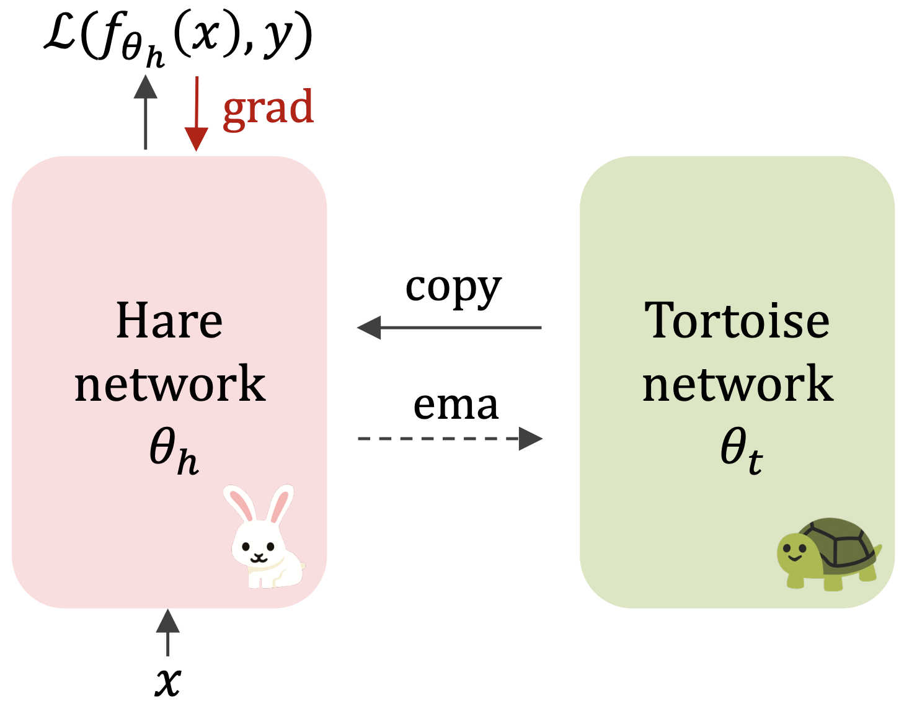

# Maintaining Plasticity with Hare and Tortoise Networks

This repository is an official PyTorch implementation of the paper, *Slow and Steady Wins the Race
Maintaining Plasticity with Hare and Tortoise Networks*, ICML 2024.

Authors: 
[Hojoon Lee](https://joonleesky.github.io/),
Hyeonseo Cho,
Donghu Kim,
[Hyunseung Kim](https://mynsng.github.io/), 
Dukgi Min,
[Jaegul Choo](https://sites.google.com/site/jaegulchoo/), and 
[Clare Lyle](https://clarelyle.com/).




## Requirements
We assume you have access to a GPU that can run CUDA 11.7 and CUDNN 9. 
Then, the simplest way to install all required dependencies is to create an anaconda environment by running

```
conda env create -f requirements.yaml
```

After the installation ends, you can activate your environment with
```
conda activate plasticity
```

## Downloading dataset

Download the dataset by running the below scripts.

```
python data/download_mnist.py --root [desired_path]
python data/download_cifar10.py --root [desired_path]
python data/download_cifar100.py --root [desired_path]
python data/download_timagenet.py --root [desired_path]
```

## Instructions

To run a single run, use the `run.py` script
```
python run.py 
```

## Reproductions

For Figure 2 & 3
```
bash scripts/paper/warm_start_wo_aug/[method].sh
```

For Figure 5
```
bash scripts/paper/warm_start_aug/[method].sh
```

For Figure 6.a & 6.b
```
bash scripts/paper/continual/[method].sh
bash scripts/paper/continual_buf/[method].sh
```


